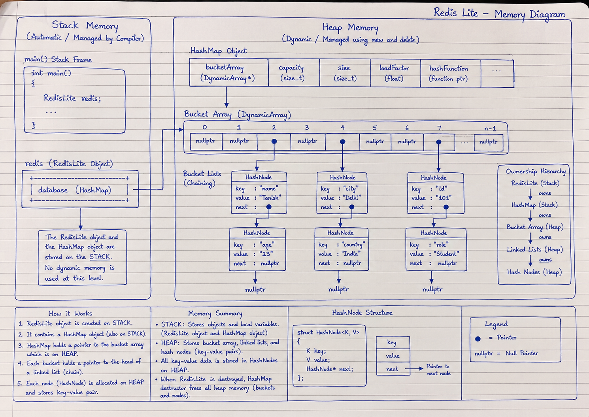

# Phase 0 – Redis Lite Design Proposal

**Project:** Collections Library (C++)  
**Component:** Redis Lite  
**Phase:** 0 – Design Proposal  
**Version:** 1.0

---

# Objective

The objective of designing Redis Lite is to build a lightweight, in-memory key-value database that demonstrates how real-world software systems utilize reusable data structures to manage information efficiently.

Unlike the previous components of the Collections Library, Redis Lite is **not a data structure**. Instead, it is an application layer that uses the Generic HashMap as its storage engine while providing a command-line interface through which users can insert, retrieve, update, and remove key-value pairs.

Redis Lite combines concepts from software engineering, data structures, memory management, and command processing into a single application. The project demonstrates how reusable software components can be integrated to form a complete system while maintaining modularity, abstraction, and separation of responsibilities.

The implementation will operate entirely in heap memory and will not provide persistence, networking, or multi-user support. These features are intentionally excluded to keep the focus on understanding how an in-memory database is built upon the Generic HashMap developed during the previous phase.

---

# Introduction

Modern software systems rarely expose their internal data structures directly to users. Instead, users interact with applications through well-defined interfaces, while the application internally delegates storage and retrieval operations to specialized data structures.

Redis Lite follows the same architectural principle.

The user communicates with the application by typing commands into the terminal. Redis Lite interprets these commands, validates the supplied arguments, and forwards the requested operation to the underlying Generic HashMap.

For example,

```text
SET name Tanish
```

does not directly insert anything into memory.

Instead, the command follows the execution path shown below.

```text
User
    │
    ▼
Redis Lite
    │
    ▼
Command Parser
    │
    ▼
HashMap::set()
    │
    ▼
Hash Function
    │
    ▼
Bucket Array
    │
    ▼
Linked List Chain
```

Similarly,

```text
GET name
```

is translated into

```cpp
database.get("name");
```

which retrieves the corresponding value from the HashMap before displaying it to the user.

Redis Lite therefore acts as an abstraction layer between the user and the underlying data structures.

---

# Project Scope

The Redis Lite application will satisfy the following project requirements.

- Command-line interface
- Single-user execution
- Single-session application
- In-memory storage only
- Generic HashMap as the storage engine
- Interactive command processing
- Automatic memory cleanup on termination


---

# High-Level Architecture

Redis Lite is organized into multiple software layers.

```text
                 +-----------------------+
                 |        User           |
                 +-----------+-----------+
                             |
                             |
                             ▼
                 +-----------------------+
                 |   Command Line (CLI)  |
                 +-----------+-----------+
                             |
                             |
                             ▼
                 +-----------------------+
                 |     Redis Lite        |
                 +-----------+-----------+
                             |
                             |
                             ▼
                 +-----------------------+
                 | Generic HashMap<K,V>  |
                 +-----------+-----------+
                             |
                             |
                             ▼
                 +-----------------------+
                 | Bucket Array + Chains |
                 +-----------------------+
```

Each layer has a clearly defined responsibility.

The command-line interface communicates with the user.

Redis Lite interprets commands and controls application flow.

The Generic HashMap performs all storage-related operations.

The Bucket Array and Linked Lists manage the physical organization of key-value pairs in heap memory.

This separation improves modularity, code reuse, maintainability, and debugging.

---

# Section 1 – Public API

## Overview

Redis Lite provides a simple and intuitive command-line interface through which users can interact with the Generic HashMap.

Unlike DynamicArray, LinkedList, or HashMap, Redis Lite does not expose low-level storage operations. Instead, every public function represents an application-level responsibility such as reading commands, parsing user input, validating syntax, dispatching operations, and displaying results.

The design intentionally separates **application logic** from **storage logic**.

Redis Lite never calculates hash values, resolves collisions, performs rehashing, or manages bucket memory directly. These responsibilities remain entirely inside the Generic HashMap.

This design follows the **Single Responsibility Principle**, allowing each component to perform only the tasks for which it was designed.

---

## Proposed Public Interface

```cpp
class RedisLite
{
public:

    // Constructor
    RedisLite();

    // Starts the interactive application
    void run();

private:

    // Storage Engine
    HashMap<std::string, std::string> database;

    // Command Processing
    void processCommand(const std::string& input);

    bool parseInput(const std::string& input);

    // Command Handlers
    void handleSet(const std::string& key,
                   const std::string& value);

    void handleGet(const std::string& key);

    void handleDelete(const std::string& key);

    void handleExists(const std::string& key);

    void handleCount();

    void handleClear();

    void printHelp() const;
};
```

---

# Redis Lite API Design Documentation

Each public member function is documented using the following structure.

- Return Type
- Parameters
- Explanation
- Exception Conditions
- Time Complexity
- Why this Design?

Using a consistent documentation format improves readability, simplifies maintenance, and clearly communicates the responsibility of every member function.

---

# Constructor

## `RedisLite();`

### Return Type

**None**

Constructors never return a value because their responsibility is to initialize a newly created object.

### Parameters

**None**

### Explanation

The constructor creates an empty Redis Lite application.

During construction, the internal Generic HashMap is initialized so that the application is immediately capable of storing key-value pairs.

No user interaction occurs during construction.

No memory for key-value pairs is allocated until the first `SET` command is executed.

### Exception Conditions

None.

Construction of the internal HashMap may propagate allocation exceptions if its initialization requires heap memory.

### Time Complexity

**Best Case:** `O(1)`

**Average Case:** `O(1)`

**Worst Case:** `O(1)`

### Why this Design?

The constructor should only establish the initial state of the application.

Separating initialization from execution allows the same Redis Lite object to be created independently from when command processing begins.

---

# run()

## `void run();`

### Return Type

```cpp
void
```

The function performs the complete execution of the Redis Lite application and therefore does not return a value.

### Parameters

**None**

### Explanation

The `run()` function represents the main execution loop of Redis Lite.

It repeatedly performs the following sequence:

1. Display the command prompt.
2. Read a complete command from the terminal.
3. Validate the input.
4. Parse the command.
5. Execute the requested operation.
6. Display the result.
7. Wait for the next command.

The loop continues until the user enters the `EXIT` command.

Unlike the storage operations implemented inside the HashMap, the `run()` function does not modify buckets or perform hashing.

Its sole responsibility is coordinating the interaction between the user and the storage engine.

### Example Execution

```text
RedisLite>

SET name Tanish

OK

RedisLite>

GET name

Tanish

RedisLite>

EXIT
```

### Exception Conditions

The function should gracefully handle invalid commands without terminating the application.

Unexpected runtime errors generated by storage operations should be reported to the user while allowing the application to continue executing whenever possible.

### Time Complexity

The complexity depends on the command being executed.

Ignoring the HashMap operation itself, the overhead of the execution loop is approximately proportional to the length of the input command.

Command dispatching itself is considered `O(1)`.

### Why this Design?

The Read-Evaluate-Print Loop (REPL) is a common architecture used by command-line systems such as Redis, Python, SQL consoles, Bash, and many interactive programming environments.

Using the same design makes Redis Lite intuitive while keeping command processing separate from storage management.

---

# processCommand()

## `void processCommand(const std::string& input);`

### Return Type

```cpp
void
```

The function dispatches the requested command to the appropriate handler and therefore does not return a value.

### Parameters

#### `const std::string& input`

| Part | Meaning |
|------|---------|
| `const` | Prevents modification of the original command string |
| `std::string` | Represents the complete user command |
| `&` | Avoids copying potentially long command strings |
| `input` | The command entered by the user |

### Explanation

The `processCommand()` function is responsible for interpreting user input after it has been read from the terminal.

Its responsibilities include:

- Identifying the command name.
- Splitting the command into tokens.
- Validating the number of arguments.
- Determining which handler should execute.
- Reporting invalid commands.
- Invoking the correct Redis Lite command handler.

For example,

```text
SET city Delhi
```

will internally invoke

```cpp
handleSet("city","Delhi");
```

Similarly,

```text
GET city
```

will invoke

```cpp
handleGet("city");
```

This design isolates command interpretation from command execution, making both components easier to test and maintain independently.

### Exception Conditions

Malformed commands are reported to the user without terminating the application.

Unknown commands result in an informative error message rather than a program failure.

### Time Complexity

**Best Case:** `O(L)`

**Average Case:** `O(L)`

**Worst Case:** `O(L)`

where **L** represents the length of the input command.

### Why this Design?

Separating command parsing from command execution follows the **Single Responsibility Principle**.

Each command handler receives validated arguments and focuses only on executing its specific operation, while `processCommand()` remains responsible for understanding the user's input.

# parseInput()

## `bool parseInput(const std::string& input);`

### Return Type

```cpp
bool
```

The function returns a boolean value indicating whether the supplied command follows the expected syntax.

### Return Values

- **`true`** → The command is syntactically valid.
- **`false`** → The command contains missing arguments, invalid formatting, or an unsupported command.

### Parameters

#### `const std::string& input`

| Part | Meaning |
|------|---------|
| `const` | Prevents accidental modification of the original command |
| `std::string` | Represents the complete command entered by the user |
| `&` | Avoids copying the entire command string |
| `input` | User supplied command |

### Explanation

Before executing any command, Redis Lite verifies that the input satisfies the expected syntax.

For example,

```text
SET name Tanish
```

is valid because it contains

- Command
- Key
- Value

However,

```text
SET
```

or

```text
GET
```

are incomplete commands and should not be executed.

Instead, Redis Lite displays an informative error message and waits for the next command.

The validation stage prevents invalid data from reaching the HashMap.

### Exception Conditions

None.

Invalid syntax results in a `false` return value instead of throwing an exception.

### Time Complexity

**Best Case:** `O(L)`

**Average Case:** `O(L)`

**Worst Case:** `O(L)`

where **L** is the command length.

### Why this Design?

Separating validation from execution simplifies every command handler because handlers can assume that the supplied arguments are already valid.

---

# handleSet()

## `void handleSet(const std::string& key, const std::string& value);`

### Return Type

```cpp
void
```

The function stores or updates a key-value pair and therefore does not return a value.

### Parameters

#### `const std::string& key`

Represents the unique identifier that will be stored inside the HashMap.

#### `const std::string& value`

Represents the value associated with the supplied key.

### Explanation

The SET command inserts a new key-value pair into the database.

If the supplied key does not exist, a new entry is created.

If the key already exists, the previous value is replaced with the new value.

Internally the function simply delegates the operation to the Generic HashMap.

```cpp
database.set(key, value);
```

Redis Lite never computes hash values itself.

The HashMap performs

- Hash calculation
- Bucket selection
- Collision resolution
- Rehashing
- Memory allocation

### Example

```text
SET name Tanish
```

Internally becomes

```cpp
database.set("name","Tanish");
```

### Exception Conditions

Memory allocation failures generated by the HashMap are propagated to the application.

### Time Complexity

Depends entirely on the HashMap implementation.

Average complexity

```text
O(1)
```

Worst case

```text
O(n)
```

### Why this Design?

Redis Lite should never duplicate storage logic already implemented inside the HashMap.

Delegation promotes modularity and code reuse.

---

# handleGet()

## `void handleGet(const std::string& key);`

### Return Type

```cpp
void
```

### Parameters

#### `const std::string& key`

The key whose value should be retrieved.

### Explanation

The GET command searches for the specified key inside the Generic HashMap.

Internally,

```cpp
database.get(key);
```

is executed.

If the key exists,

its associated value is displayed.

If the key does not exist,

an appropriate error message is printed.

Redis Lite performs no searching itself.

Searching is entirely delegated to the HashMap.

### Example

```text
GET city
```

becomes

```cpp
database.get("city");
```

### Time Complexity

Average

```text
O(1)
```

Worst

```text
O(n)
```

### Why this Design?

Separating user interaction from storage simplifies both components.

---

# handleDelete()

## `void handleDelete(const std::string& key);`

### Return Type

```cpp
void
```

### Parameters

#### `const std::string& key`

The key that should be removed.

### Explanation

The DEL command removes an existing key-value pair from the database.

Internally

```cpp
database.remove(key);
```

is executed.

If the key exists,

the corresponding node is removed from the HashMap.

If the key does not exist,

Redis Lite reports the failure to the user.

### Example

```text
DEL age
```

↓

```cpp
database.remove("age");
```

### Time Complexity

Average

```text
O(1)
```

Worst

```text
O(n)
```

### Why this Design?

Deletion belongs entirely to the HashMap because only the HashMap understands bucket organization and collision chains.

---

# handleExists()

## `void handleExists(const std::string& key);`

### Return Type

```cpp
void
```

### Parameters

#### `const std::string& key`

The key being searched.

### Explanation

Checks whether a specified key currently exists.

Internally

```cpp
database.contains(key);
```

or

```cpp
database.exists(key);
```

depending upon the final HashMap API.

The returned boolean value is displayed as

```text
true
```

or

```text
false
```

### Example

```text
EXISTS name
```

↓

```cpp
database.contains("name");
```

### Time Complexity

Average

```text
O(1)
```

Worst

```text
O(n)
```

### Why this Design?

A dedicated EXISTS command avoids retrieving the stored value when only presence verification is required.

---

# handleCount()

## `void handleCount();`

### Return Type

```cpp
void
```

### Parameters

None.

### Explanation

Displays the total number of key-value pairs currently stored inside the HashMap.

Internally,

```cpp
database.size();
```

is executed.

Unlike counting buckets,

this command reports the number of stored entries.

### Example

```text
COUNT

Output

12
```

### Time Complexity

```text
O(1)
```

### Why this Design?

The HashMap already maintains its size.

Redis Lite should simply reuse it.

---

# handleClear()

## `void handleClear();`

### Return Type

```cpp
void
```

### Parameters

None.

### Explanation

Deletes every key-value pair stored in the database.

Internally,

```cpp
database.clear();
```

is executed.

The HashMap traverses every bucket,

deletes every collision chain,

and resets itself to an empty state.

Redis Lite merely reports completion.

### Example

```text
CLEAR

↓

OK
```

### Time Complexity

```text
O(n)
```

where **n** is the total number of stored key-value pairs.

### Why this Design?

Only the HashMap understands its internal memory organization.

Redis Lite simply requests the operation.

---

# printHelp()

## `void printHelp() const;`

### Return Type

```cpp
void
```

### Parameters

None.

### Explanation

Displays all commands supported by Redis Lite together with a short explanation.

Example output

```text
SET key value

GET key

DEL key

EXISTS key

COUNT

CLEAR

HELP

EXIT
```

The function performs no storage operations.

It exists solely to improve usability.

### Time Complexity

```text
O(1)
```

### Why this Design?

Providing a built-in help command improves user experience and reduces the need for external documentation.

---

# Summary of Return Types

| Return Type | Purpose | Example |
|-------------|---------|---------|
| `void` | Performs an operation without returning data | `handleSet()` |
| `bool` | Indicates success or failure | `parseInput()` |

---

# Summary of Parameter Types

| Parameter | Purpose |
|-----------|---------|
| `const std::string&` | Accepts command strings efficiently without copying |
| No Parameters | Commands that operate on the entire database |

---

# Summary of const Usage

| Syntax | Purpose |
|---------|---------|
| `const std::string&` | Read-only reference to user input |
| `printHelp() const` | Guarantees that displaying help does not modify the Redis Lite object |

# Section 2 – Internal Structure

The **Internal Structure** section explains how Redis Lite is organized internally, how the different software components interact, and how data flows from the user to the underlying Generic HashMap.

Unlike DynamicArray, LinkedList, and HashMap, Redis Lite is **not responsible for storing data**. Instead, it acts as an application layer that coordinates communication between the user and the storage engine.

Its primary responsibilities include:

- Reading commands from the terminal
- Parsing user input
- Validating command syntax
- Calling the appropriate HashMap operation
- Displaying results to the user

Redis Lite never computes hash values, manages bucket arrays, resolves collisions, or allocates storage nodes directly. These responsibilities remain entirely within the Generic HashMap.

---

# Overall System Architecture

Redis Lite follows a layered architecture.

```text
                   User
                     │
                     ▼
          +----------------------+
          |   Command Line (CLI) |
          +----------+-----------+
                     │
                     ▼
          +----------------------+
          |      Redis Lite      |
          +----------+-----------+
                     │
                     ▼
          +----------------------+
          | Generic HashMap<K,V> |
          +----------+-----------+
                     │
                     ▼
          +----------------------+
          |   Bucket Array        |
          +----------+-----------+
                     │
                     ▼
          Linked Lists (Chains)
```

Each layer has a clearly defined responsibility.

---

# Responsibilities of Each Layer

## User

The user interacts with Redis Lite through textual commands.

Examples include

```text
SET name Tanish

GET name

DEL city

COUNT

EXIT
```

The user has no knowledge of the internal HashMap implementation.

---

## Command Line Interface (CLI)

The CLI continuously accepts commands entered by the user.

Its responsibilities include

- Reading complete lines of input
- Displaying prompts
- Displaying output
- Remaining interactive until the program terminates

The CLI performs no storage operations.

---

## Redis Lite

Redis Lite is the controller of the application.

Responsibilities include

- Parsing commands
- Validating syntax
- Calling the correct command handler
- Handling invalid input
- Coordinating communication between the CLI and HashMap

Redis Lite never stores data itself.

---

## Generic HashMap

The Generic HashMap acts as the storage engine.

Responsibilities include

- Hash computation
- Bucket selection
- Collision resolution
- Dynamic resizing
- Rehashing
- Memory management
- Object lifetime management

Redis Lite treats the HashMap as a reusable component.

---

## Bucket Array

The HashMap internally maintains a DynamicArray containing bucket pointers.

Each bucket stores the head of a collision chain.

Example

```text
Bucket 0

Bucket 1

Bucket 2

Bucket 3

Bucket 4
```

Redis Lite never accesses bucket memory directly.

---

## Collision Chains

Whenever multiple keys map to the same bucket,

the HashMap stores them inside Linked Lists.

Example

```text
Bucket 3

↓

[name : Tanish]

↓

[city : Delhi]

↓

[age : 23]

↓

nullptr
```

Redis Lite never traverses these chains.

---

# Internal Data Members

Redis Lite maintains only a small amount of state.

```cpp
class RedisLite
{
private:

    HashMap<std::string,std::string> database;
};
```

Unlike the previous data structures,

Redis Lite does not require

- head pointers
- bucket arrays
- capacity variables
- linked nodes

It simply owns one Generic HashMap object.

---
---

# Memory Layout

The following memory layout illustrates how the Redis Lite application is organized in memory during execution.

Unlike the previous components of the Collections Library, Redis Lite owns only a single `HashMap` object. The HashMap, in turn, owns the bucket array, collision chains, and every dynamically allocated hash node.

All user commands interact with the Redis Lite object, while all key-value storage remains inside the HashMap.

## Memory Diagram




The ownership hierarchy shown in the diagram can be summarized as follows:

```text
RedisLite
    │
    ▼
HashMap
    │
    ▼
Bucket Array
    │
    ▼
Linked Lists
    │
    ▼
Hash Nodes
```

This ownership model ensures that destroying the Redis Lite object automatically destroys the HashMap, which subsequently releases every bucket, linked list, and hash node. As a result, Redis Lite itself never performs manual memory management for stored key-value pairs.
# Object Ownership

Ownership is extremely important because it determines which object is responsible for releasing dynamically allocated memory.

Redis Lite follows strict ownership rules.

```text
RedisLite

owns

↓

HashMap

owns

↓

Bucket Array

owns

↓

Linked Lists

own

↓

Hash Nodes
```

Therefore

Redis Lite owns

- HashMap object

HashMap owns

- Bucket Array
- Linked Lists
- Hash Nodes

The Linked Lists own

- Individual collision nodes

Every object is responsible only for its own resources.

---

# Memory Management Policy

Redis Lite does **not** allocate heap memory for key-value storage.

Instead,

every allocation request is delegated to the Generic HashMap.

For example,

```text
SET name Tanish
```

causes

```cpp
database.set("name","Tanish");
```

The HashMap then

- Computes the hash
- Finds the bucket
- Allocates a node
- Inserts the node
- Updates the size

Redis Lite never performs these operations directly.

This greatly reduces coupling between application logic and storage logic.

---

# Lifetime of Objects

The lifetime of the primary objects is shown below.

```text
Program Starts

↓

RedisLite Constructor

↓

HashMap Constructor

↓

User Commands

↓

HashMap stores data

↓

User enters EXIT

↓

RedisLite Destructor

↓

HashMap Destructor

↓

Bucket Array Destroyed

↓

Linked Lists Destroyed

↓

All Nodes Freed

↓

Program Terminates
```

Because ownership flows downward,

destroying the Redis Lite object automatically destroys every stored key-value pair.

---

# Read-Evaluate-Print Loop (REPL)

Redis Lite follows the REPL model.

REPL stands for

**Read**

↓

**Evaluate**

↓

**Print**

↓

**Loop**

This execution model is used by

- Redis
- Python Interpreter
- SQL Console
- Bash
- JavaScript Console

---

# REPL Workflow

```text
while(true)

    Read Command

    Parse Command

    Validate

    Execute

    Print Result

Repeat
```

The loop continues until

```text
EXIT
```

is entered.

---

# Command Processing Pipeline

Suppose the user types

```text
SET city Delhi
```

The complete execution flow becomes

```text
User

↓

CLI

↓

Read Input

↓

processCommand()

↓

parseInput()

↓

handleSet()

↓

HashMap::set()

↓

Hash Function

↓

Bucket Selected

↓

Collision Resolution

↓

Insert Node

↓

Return Success

↓

Display "OK"
```

Redis Lite itself performs no hashing.

---

# GET Command Flow

Suppose the user enters

```text
GET city
```

Execution becomes

```text
User

↓

CLI

↓

processCommand()

↓

handleGet()

↓

HashMap::get()

↓

Hash Function

↓

Locate Bucket

↓

Traverse Collision Chain

↓

Value Found

↓

Return Value

↓

Display Delhi
```

---

# DELETE Command Flow

Suppose

```text
DEL city
```

Execution

```text
User

↓

handleDelete()

↓

HashMap::remove()

↓

Locate Bucket

↓

Find Matching Node

↓

Delete Node

↓

Release Memory

↓

Update Size

↓

Display Success
```

Redis Lite itself never releases node memory.

---

# COUNT Command Flow

```text
COUNT

↓

handleCount()

↓

HashMap::size()

↓

Return Number

↓

Display Count
```

No traversal occurs because the HashMap maintains the element count internally.

---

# CLEAR Command Flow

```text
CLEAR

↓

handleClear()

↓

HashMap::clear()

↓

Traverse Every Bucket

↓

Delete Every Collision Chain

↓

Reset Buckets

↓

Size = 0

↓

Display Success
```

---

# Command Dispatching

Redis Lite dispatches commands based on the first token entered by the user.

Example

```text
SET name Tanish
```

becomes

```cpp
if(command=="SET")

    handleSet(key,value);
```

Similarly,

```text
GET name
```

becomes

```cpp
if(command=="GET")

    handleGet(key);
```

Every command has exactly one dedicated handler.

This simplifies debugging and improves maintainability.

---

# Error Handling Strategy

Redis Lite validates every command before execution.

Possible errors include

- Unknown command
- Missing key
- Missing value
- Extra arguments
- Invalid syntax

Instead of terminating,

Redis Lite displays an informative message and waits for the next command.

Example

```text
SET

Error:

SET requires

Key

Value
```

The application remains interactive.

---

# Separation of Responsibilities

One of the primary design goals of Redis Lite is maintaining a clear separation between application logic and storage logic.

| Component | Responsibility |
|-----------|----------------|
| User | Enters commands |
| CLI | Reads and displays text |
| Redis Lite | Parses commands and coordinates execution |
| HashMap | Stores key-value pairs |
| DynamicArray | Stores bucket pointers |
| LinkedList | Handles collisions |
| Hash Node | Stores individual key-value pairs |

Each class performs only the tasks for which it was designed.

This modular architecture improves

- Maintainability
- Code reuse
- Debugging
- Testing
- Future extensibility

---

# Object-Oriented Programming Principles Used

Redis Lite applies several important software engineering principles.

### Encapsulation

The internal HashMap is stored as a private member.

Users cannot manipulate buckets directly.

---

### Abstraction

Users interact only through simple commands such as

```text
SET

GET

DEL
```

They never see

- Hash functions
- Buckets
- Collision chains
- Rehashing

---

### Modularity

Each command is implemented as a separate member function.

Examples

- handleSet()
- handleGet()
- handleDelete()

Each function has one clearly defined responsibility.

---

### Code Reuse

Redis Lite reuses the Generic HashMap without modification.

Instead of implementing another storage engine,

it simply delegates every storage operation to the HashMap.

This minimizes duplicate code and demonstrates proper software architecture.

---

# Summary

Redis Lite is intentionally designed as a lightweight application layer rather than a storage container.

It owns only a Generic HashMap object and delegates every storage-related operation to that component.

This layered architecture demonstrates how reusable data structures can be composed to build complete software systems while preserving modularity, abstraction, and separation of responsibilities.

# Section 3 – Complexity Estimates

The performance of Redis Lite depends primarily on the performance of the underlying Generic HashMap. Redis Lite itself performs only command parsing, validation, and delegation. It does not directly store, search, or delete any data.

Most Redis Lite commands simply invoke a corresponding HashMap member function. Therefore, the overall complexity of each command is dominated by the complexity of the HashMap operation it performs.

The following table summarizes the expected time complexity of every public command supported by Redis Lite.

---

## Complexity Summary

| Command | Best Case | Average Case | Worst Case | Reason |
|----------|:---------:|:------------:|:----------:|--------|
| `SET` | `O(1)` | `O(1)` | `O(n)` | Computes the bucket directly using the hash function. Worst case occurs when all keys collide into the same bucket or when rehashing is triggered. |
| `GET` | `O(1)` | `O(1)` | `O(n)` | Computes the bucket and searches only the corresponding collision chain. Worst case occurs when every key is stored in the same bucket. |
| `DEL` | `O(1)` | `O(1)` | `O(n)` | Removes a key from its bucket chain. Worst case occurs when the entire collision chain must be traversed. |
| `EXISTS` | `O(1)` | `O(1)` | `O(n)` | Searches for the requested key inside its collision chain. |
| `COUNT` | `O(1)` | `O(1)` | `O(1)` | Returns the maintained element count directly without traversal. |
| `CLEAR` | `O(n)` | `O(n)` | `O(n)` | Every stored key-value pair must be deleted exactly once. |
| `HELP` | `O(1)` | `O(1)` | `O(1)` | Displays a predefined list of supported commands. |
| `EXIT` | `O(1)` | `O(1)` | `O(1)` | Terminates the command-processing loop immediately. |

---

# Complexity Analysis

The following section explains why each command has its corresponding complexity.

---

# SET Command

## Best Case — `O(1)`

The hash function immediately computes the destination bucket.

The bucket is empty, so the new key-value pair is inserted without any collision.

No resizing or rehashing is required.

---

## Average Case — `O(1)`

A good hash function distributes keys uniformly across the bucket array.

As a result, collision chains remain very short.

Only a small number of nodes are examined before insertion.

Therefore, insertion requires approximately constant time.

---

## Worst Case — `O(n)`

The worst case occurs under either of the following conditions.

- Every key hashes to the same bucket.
- Rehashing is triggered after exceeding the load factor.

In the first case, the collision chain may contain all stored elements.

In the second case, every key-value pair must be rehashed and inserted into the new bucket array.

---

# GET Command

## Best Case — `O(1)`

The requested key hashes directly to the correct bucket.

The first node in the bucket matches the requested key.

The value is returned immediately.

---

## Average Case — `O(1)`

Most buckets contain very few nodes because the hash function distributes keys evenly.

Only a short collision chain needs to be traversed before locating the requested key.

---

## Worst Case — `O(n)`

If every key maps to the same bucket, the requested key may be located at the end of the collision chain.

Every stored key may need to be examined before the correct value is found.

---

# DEL Command

## Best Case — `O(1)`

The key is stored as the first node in its collision chain.

Deletion requires only a small number of pointer updates.

---

## Average Case — `O(1)`

The hash function limits the search to a single bucket.

Only a few nodes are typically examined before deletion.

---

## Worst Case — `O(n)`

If every key collides into one bucket, the requested key may appear at the end of the linked list.

The entire collision chain must be traversed before deletion.

---

# EXISTS Command

## Best Case — `O(1)`

The requested key is located immediately.

The function returns `true` without traversing additional nodes.

---

## Average Case — `O(1)`

Only a short collision chain is searched because keys are distributed uniformly.

---

## Worst Case — `O(n)`

All stored keys reside inside a single collision chain.

The requested key may be absent or appear at the end of the chain.

---

# COUNT Command

## Best Case — `O(1)`

Returns the maintained element count.

---

## Average Case — `O(1)`

No traversal is required because the HashMap maintains its size internally.

---

## Worst Case — `O(1)`

The complexity never changes regardless of the number of stored elements.

---

# CLEAR Command

## Best Case — `O(n)`

Every stored key-value pair must be deleted.

Even when no collisions exist, each node must still be released individually.

---

## Average Case — `O(n)`

Each bucket is visited exactly once, and every stored node is deleted.

---

## Worst Case — `O(n)`

The total number of deletions remains proportional to the number of stored elements.

Although collisions may increase the length of individual chains, every node is still deleted exactly once.

---

# HELP Command

## Best Case — `O(1)`

Displays a predefined help message.

---

## Average Case — `O(1)`

The number of supported commands remains constant.

---

## Worst Case — `O(1)`

The help text never depends on the number of stored key-value pairs.

---

# EXIT Command

## Best Case — `O(1)`

Immediately terminates the command loop.

---

## Average Case — `O(1)`

Execution stops without performing additional operations.

---

## Worst Case — `O(1)`

The complexity remains constant because the loop exits immediately.

---

# Overall Complexity Discussion

Redis Lite itself introduces very little computational overhead.

Its responsibilities are limited to:

- Reading user input.
- Parsing commands.
- Validating syntax.
- Delegating operations to the Generic HashMap.
- Displaying results.

The expensive operations such as hashing, collision resolution, dynamic resizing, memory allocation, rehashing, and node deletion are all performed by the Generic HashMap.

Consequently, the overall performance of Redis Lite is determined almost entirely by the quality of the underlying HashMap implementation.

Maintaining a well-distributed hash function, an appropriate load factor, and efficient collision handling ensures that the majority of Redis Lite commands execute in constant average time, making the application suitable for fast in-memory key-value storage.

# Section 4 – Design Decisions

This section explains the major architectural and engineering decisions made during the design of Redis Lite.

For every important design choice, alternative approaches were evaluated before selecting the final implementation.

The objective was to build a lightweight, modular, reusable, and maintainable in-memory database while maximizing reuse of the previously developed Collections Library.

---

# 1. Using the Generic HashMap as the Storage Engine

## Selected Design

Redis Lite uses the previously implemented **Generic HashMap** as its underlying storage engine.

```cpp
HashMap<std::string, std::string> database;
```

---

## Alternative Considered

Implementing another storage mechanism inside Redis Lite using

- Dynamic Array
- Linked List
- Fixed Array
- Custom database implementation

---

## Reason for Rejection

Creating another storage implementation would duplicate functionality that already exists inside the Generic HashMap.

It would

- Increase code duplication.
- Increase maintenance effort.
- Introduce unnecessary complexity.
- Violate software engineering principles.

---

## Reason for Selection

The Generic HashMap already provides

- Fast lookup
- Fast insertion
- Fast deletion
- Collision handling
- Dynamic resizing
- Memory management
- Generic programming support

Redis Lite simply reuses these capabilities instead of reimplementing them.

This demonstrates one of the primary goals of software engineering:

> **Reuse existing components whenever possible instead of reinventing them.**

---

# 2. Layered Architecture

## Selected Design

Redis Lite follows a layered architecture.

```text
User

↓

CLI

↓

Redis Lite

↓

HashMap

↓

Dynamic Array

↓

Linked Lists
```

---

## Alternative Considered

Combining

- User interaction
- Command parsing
- Storage
- Memory management

inside one large class.

---

## Reason for Rejection

A monolithic implementation would

- Increase coupling.
- Reduce maintainability.
- Make debugging difficult.
- Prevent reuse of components.

---

## Reason for Selection

Each software layer has one clearly defined responsibility.

For example

| Layer | Responsibility |
|--------|----------------|
| CLI | Reads user input |
| Redis Lite | Processes commands |
| HashMap | Stores data |
| DynamicArray | Stores buckets |
| LinkedList | Resolves collisions |

This separation improves

- Maintainability
- Readability
- Testing
- Future extensibility

---

# 3. Command-Line Interface (CLI)

## Selected Design

Redis Lite uses an interactive terminal-based command-line interface.

Example

```text
SET name Tanish

GET name

COUNT

EXIT
```

---

## Alternative Considered

- Graphical User Interface (GUI)
- Web Application
- REST API
- TCP Server

---

## Reason for Rejection

These alternatives require

- Networking
- Event handling
- Additional frameworks
- More complex software architecture

They are outside the scope of this project.

---

## Reason for Selection

A command-line interface

- Is simple to implement.
- Is easy to debug.
- Matches the assignment requirements.
- Closely resembles the real Redis console.

---

# 4. Read-Evaluate-Print Loop (REPL)

## Selected Design

Redis Lite uses a REPL execution model.

```text
Read

↓

Evaluate

↓

Print

↓

Repeat
```

---

## Alternative Considered

Executing only one command before terminating the application.

---

## Reason for Rejection

Restarting the application after every command would create an inconvenient user experience.

---

## Reason for Selection

REPL provides

- Continuous interaction
- Immediate feedback
- Better usability

This is the same execution model used by

- Redis
- Python
- SQL
- Bash
- JavaScript Console

---

# 5. Delegating All Storage Operations

## Selected Design

Redis Lite delegates every storage-related operation to the Generic HashMap.

Examples

```cpp
database.set()

database.get()

database.remove()

database.contains()

database.clear()
```

---

## Alternative Considered

Allowing Redis Lite to

- Traverse buckets
- Manage linked lists
- Compute hash values

---

## Reason for Rejection

Redis Lite should not understand the internal implementation of the HashMap.

Doing so would tightly couple the application to one specific implementation.

---

## Reason for Selection

Delegation

- Reduces coupling.
- Increases modularity.
- Improves maintainability.
- Allows HashMap to evolve independently.

---

# 6. In-Memory Storage

## Selected Design

Redis Lite stores all key-value pairs exclusively in memory.

---

## Alternative Considered

Saving data to

- Text files
- Binary files
- Databases

---

## Reason for Rejection

Persistent storage

- Requires file handling.
- Requires serialization.
- Increases implementation complexity.

The assignment explicitly specifies an in-memory database.

---

## Reason for Selection

Keeping all data in memory

- Simplifies implementation.
- Provides very fast access.
- Matches the architecture of Redis Lite.
- Demonstrates efficient HashMap usage.

---

# 7. No Networking

## Selected Design

Redis Lite is a standalone application.

Only one local user can interact with it.

---

## Alternative Considered

Implementing

- TCP sockets
- Client-server communication
- Remote clients

---

## Reason for Rejection

Networking introduces

- Socket programming
- Concurrency
- Synchronization
- Protocol design

These topics are outside the objectives of this project.

---

## Reason for Selection

A local application keeps the focus on

- Data structures
- Memory management
- Command processing

rather than networking.

---

# 8. Error Handling Strategy

## Selected Design

Redis Lite validates every command before execution.

Errors are reported without terminating the application.

Examples

```text
Unknown Command

Missing Key

Missing Value

Invalid Syntax
```

---

## Alternative Considered

Terminating the application whenever an invalid command is entered.

---

## Reason for Rejection

Unexpected termination creates a poor user experience.

---

## Reason for Selection

Graceful error handling

- Improves robustness.
- Allows continued execution.
- Makes debugging easier.

---

# 9. Command Dispatching

## Selected Design

Every supported command has its own dedicated handler.

Example

```text
SET

↓

handleSet()

GET

↓

handleGet()

DEL

↓

handleDelete()
```

---

## Alternative Considered

Implementing every command inside one extremely large function.

---

## Reason for Rejection

Large functions

- Become difficult to debug.
- Increase code duplication.
- Reduce readability.

---

## Reason for Selection

Dedicated handlers

- Improve modularity.
- Simplify maintenance.
- Follow the Single Responsibility Principle.

---

# 10. Generic String-Based Interface

## Selected Design

Redis Lite stores

```cpp
HashMap<std::string,std::string>
```

---

## Alternative Considered

Supporting arbitrary template types.

---

## Reason for Rejection

Redis commands are textual.

The command-line interface naturally produces strings.

Supporting arbitrary template types would require

- Parsing user-defined objects.
- Runtime type conversion.
- Additional serialization logic.

---

## Reason for Selection

Using strings

- Matches Redis behavior.
- Simplifies parsing.
- Simplifies storage.
- Improves usability.

---

# 11. Separation of Concerns

## Selected Design

Every component performs exactly one responsibility.

| Component | Responsibility |
|-----------|----------------|
| CLI | Input / Output |
| Redis Lite | Command Processing |
| HashMap | Storage |
| DynamicArray | Bucket Management |
| LinkedList | Collision Handling |

---

## Alternative Considered

Allowing every class to perform multiple unrelated tasks.

---

## Reason for Rejection

Mixing responsibilities

- Increases coupling.
- Makes testing difficult.
- Reduces maintainability.

---

## Reason for Selection

Following the **Single Responsibility Principle (SRP)** produces

- Cleaner code
- Better architecture
- Easier debugging
- Easier extension

---

# 12. Future Extensibility

## Selected Design

Redis Lite is intentionally designed so additional commands can be added with minimal changes.

Examples

```text
KEYS

TTL

RENAME

FLUSH

SAVE

LOAD
```

Each new command would simply require

- A new handler function.
- A new dispatch condition.
- Appropriate HashMap operations.

---

## Reason for Selection

Designing for extensibility ensures that the application can evolve without requiring major architectural changes.

---

# Final Design Summary

Redis Lite is intentionally designed as a lightweight application layer built entirely on top of the Generic HashMap.

Instead of implementing another storage engine, it reuses the previously developed Collections Library while maintaining clear abstraction boundaries between user interaction, command processing, and data storage.

The design emphasizes several important software engineering principles, including

- Modularity
- Code Reuse
- Encapsulation
- Abstraction
- Separation of Concerns
- Single Responsibility Principle

By delegating all storage responsibilities to the Generic HashMap, Redis Lite remains simple, maintainable, and extensible while accurately demonstrating how real-world in-memory databases are architected.

This design not only satisfies the functional requirements of the project but also provides a strong foundation for future enhancements such as persistence, networking, key expiration (TTL), authentication, transaction support, and distributed execution without requiring fundamental changes to the existing architecture.

---
# Conclusion

Redis Lite represents the final integration phase of the Collections Library project.

Unlike the previous phases, which focused on implementing reusable data structures, Redis Lite demonstrates how those data structures can be combined to build a complete software system.

Through the integration of the Generic HashMap, command-line interface, and modular application architecture, Redis Lite illustrates the practical application of data structures, object-oriented programming, software architecture, and memory management in the design of a real-world key-value database.

The resulting system is lightweight, efficient, reusable, and well-structured, providing a solid foundation for understanding larger systems such as Redis while remaining appropriately scoped for the objectives of this project.